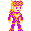

# Freeway clone meets Jojos Bizarre Adventure

# Descrição do projeto

Seguindo os ensinamentos do curso de Jogos Clássicos parte 2 da Alura, recriei o famoso Freeway do Atari mesclando os atores com Jojo's Bizarre Adventures. Cores dos carros alteradas no Photoshop para se assemelharem à palheta de cores dos personagens e sprite do ator criado pelo MisterMike, disponível no banco [The Spriters Resource](https://lnkd.in/gSHpuG94).

# Instruções
Clique na tela do jogo para focar e use as setas do teclado para cima e para baixo para movimentar o personagem. O objetivo é cruzar a rua sem ser atingido pelos carros. Cada vez que atravessar em segurança, um ponto é adicionado. Cada vez que for atingido, um ponto é perdido.

# Acesso ao projeto

Você pode acessar o deploy do projeto [aqui](https://freeway-clone-meets-jojos-bizarre-adventure.vercel.app)

# Abrir e rodar o projeto

- Crie um clone de `https://github.com/vtbrgt/Freeway-clone-meets-Jojos-Bizarre-Adventure`
- Use uma extensão (como Live Server) para rodá-lo

# Tecnologias utilizadas 👨🏻‍💻

- `JavaScript / p5.js`

# Autor

### Vitor Borgatte

<b>Todos os direitos autorais reservados. Projeto criado com fins educacionais sem interesse comercial.</b>
